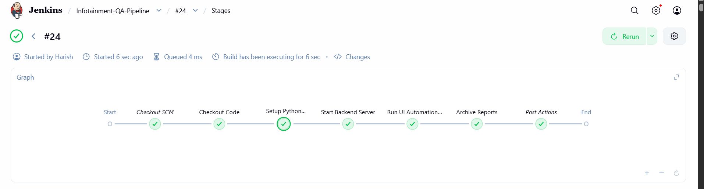

# 🚗 Infotainment UI Automation Framework

End-to-end automated testing framework for a simulated vehicle infotainment system.

This project validates UI interactions, API state, and system workflows using:

- 🧪 **Pytest** – Test framework
- 🎭 **Playwright (Python)** – UI automation
- 🔗 **Requests** – API validation
- ⚙️ **Pydantic** – Response schema validation
- 🐳 **Docker** – Test environment isolation
- 🤖 **Jenkins** – CI/CD pipeline

---

## 📌 Project Objective

This framework simulates real-world automotive software testing where:

- ✔ UI actions update backend vehicle systems
- ✔ APIs reflect the updated vehicle state
- ✔ Tests validate end-to-end system behavior

**Modules covered:**

- 🌡 Climate Control
- 🎵 Media System
- 🧭 Navigation
- ⚙️ Vehicle Settings

---

## 📁 Project Structure

```
Infotainment-UI-Testing/
│
├── Jenkinsfile
├── README.md
├── index.html
├── main.py
├── models.py
├── pytest.ini
├── requirements.txt
├── tests
│   ├── regression
│   │   ├── __init__.py
│   │   ├── test_climate_regression.py
│   │   ├── test_climate_ui.py
│   │   ├── test_media_regression.py
│   │   ├── test_media_ui.py
│   │   ├── test_navigation_regression.py
│   │   └── test_settings_regression.py
│   └── smoke
│       ├── test_climate_smoke.py
│       ├── test_media_smoke.py
│       └── test_navigation_smoke.py
└── validators
    ├── __init__.py
    ├── climate_validator.py
    └── media_validator.py
```

---

## ⚙️ Setup Instructions (Local Machine)

### 1️⃣ Clone Repository

```bash
git clone https://github.com/HarishSingaravelan/Infotaiment-UI-Automation-Testing.git
cd infotainment-ui-testing
```

### 2️⃣ Create Virtual Environment

```bash
python -m venv venv
venv\Scripts\activate   # Windows
# source venv/bin/activate  # Mac/Linux
```

### 3️⃣ Install Dependencies

```bash
pip install -r requirements.txt
playwright install
```

### 4️⃣ Start Backend Server

```bash
uvicorn app.main:app --reload
```

Server runs at: **http://127.0.0.1:8000**

---

## ▶️ Running Tests Locally

### Run All Tests

```bash
pytest tests
```

### Run Smoke Tests Only

```bash
pytest tests/smoke
```

### Run Regression Tests Only

```bash
pytest tests/regression
```

### Run With Verbose Output

```bash
pytest -v
```

---

## 🤖 Jenkins CI/CD Pipeline

This project is CI-enabled using Jenkins + Docker.

**Pipeline stages:**

1. Checkout Code
2. Build Docker Test Image
3. Run Pytest Suite
4. Publish Test Results

### Jenkins Requirements

Jenkins must be started with Docker socket access:

```bash
docker run -d \
  --name jenkins \
  -p 8080:8080 -p 50000:50000 \
  -v jenkins_home:/var/jenkins_home \
  -v /var/run/docker.sock:/var/run/docker.sock \
  -v /usr/bin/docker:/usr/bin/docker \
  jenkins/jenkins:lts
```

```bash
docker exec -u root -it jenkins bash -c "chmod 666 /var/run/docker.sock"

```

### 📸 Jenkins Pipeline Screenshot




---

## ✅ Test Coverage Includes

| Module     | UI Tested | API Validated | End-to-End Flow |
|------------|-----------|---------------|-----------------|
| Climate    | ✅        | ✅            | ✅              |
| Media      | ✅        | ✅            | ✅              |
| Navigation | ✅        | ✅            | ✅              |
| Settings   | ✅        | ✅            | ✅              |

---

## 🧠 Validation Strategy

We don't just check UI clicks — we verify system integrity:

- ✔ UI → Backend API sync
- ✔ API response schema using Pydantic
- ✔ State reset between tests
- ✔ Smoke vs Regression separation

---

## 🚀 Future Enhancements

- 📊 Allure / HTML Test Reports
- 📱 Mobile infotainment simulation
- 🌍 Cross-browser testing
- 🔁 Parallel test execution in CI
- 📦 Docker Compose for full system spin-up

---

## 👨‍💻 Author

**Harish Singaravelan**  
Master's in Data Science  
Automation | ML | Systems Testing

---

## 🤝 Contributing

Contributions, issues, and feature requests are welcome!

Feel free to check the [issues page](https://github.com/HarishSingaravelan/Infotaiment-UI-Automation-Testing/issues).

---

## ⭐ Show your support

Give a ⭐️ if this project helped you!